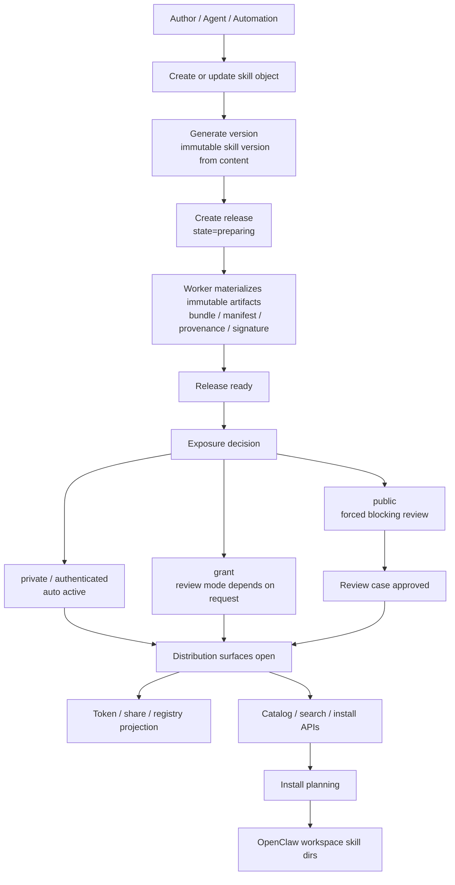
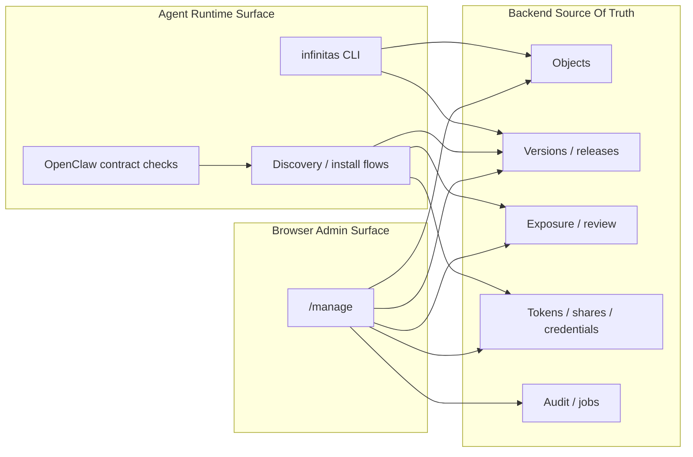
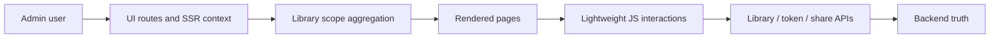

```mermaid
flowchart LR
  A["Agent / automation"] --> B["CLI or publish API"]
  B --> C["Publish object facade"]
  C --> D["Internal versioning lifecycle"]
  D --> E["Release created"]
  E --> F["Materialization worker"]
  F --> G["Ready release"]
  G --> H["Exposure and review policy"]
  H --> I["Catalog / search / install API"]
  I --> J["Install plan"]
  J --> K["OpenClaw workspace directories"]
```

# Control-Plane Business Flows

This guide summarizes the maintained business flows for `infinitas-skill` after the private-first and OpenClaw-first cutovers.

The old lifecycle model is not maintained as a product story. Its routes and storage forms have been removed, and new work must use the canonical `object/release/exposure/distribution` flow.

Use this page when you need one conceptual model that explains:

- how agent-facing publish, discovery, and install flows work
- how the browser admin surface maps onto the same backend lifecycle
- where the real source-of-truth boundaries live
- which parts of the current implementation still show dual-track or migration-era behavior

For lower-level route and command details, continue into:

- [Frontend control-plane alignment](frontend-control-plane-alignment.md)
- [OpenClaw runtime contract](../reference/openclaw-runtime-contract.md)
- [API reference](../reference/api-reference.md)
- [CLI reference](../reference/cli-reference.md)

## One-sentence model

`infinitas-skill` is a private-first distribution control plane.

It does not treat "skill exists" or even "release exists" as enough for downstream use. A downstream agent or human only reaches a usable install surface after the object has passed through release materialization, audience-scoped exposure, and access distribution.

## Unified Overview

## Source-Of-Truth Boundary

The repository uses one backend truth set for both agent and frontend flows:

- `Skill` is the durable identity for the maintained `skill` object kind
- version and release state remain backend-owned
- immutable release artifacts remain backend-owned
- exposure, review, token, share, and audit state remain backend-owned
- OpenClaw defines runtime semantics, but it does not replace release or access truth

That separation is important because the project intentionally avoids letting the runtime itself become the authority for release governance.

## Runtime And Admin Surfaces

## Agent Version

### Primary goal

The agent-facing product surface is optimized for publication, discovery, and installation into the OpenClaw runtime model.

The maintained entrypoint is the package CLI:

- `infinitas discovery ...`
- `infinitas install ...`
- `infinitas openclaw ...`
- `infinitas release ...`
- `infinitas registry ...`

### Flow summary

### Detailed narrative

1. The agent starts from the maintained CLI or the publish facade.
2. Object creation is object-centric; skill versions are created directly from content.
3. Release creation consumes the immutable skill version and begins materialization.
4. A new release begins in `preparing`.
5. A worker materializes immutable artifacts before the release becomes `ready`.
6. A ready release still cannot be used broadly until exposure policy opens the appropriate audience surface.
7. Discovery and install then resolve from audience-scoped projections and immutable release artifacts.
8. The final local result is an OpenClaw-targeted install plan against workspace or shared skill directories.

### Why this matters

This means the agent-facing happy path deliberately hides lifecycle complexity without deleting it. The facade simplifies how callers think, but the backend still preserves stronger release invariants than a simple "upload and use" model.

## Frontend Version

### Primary goal

The browser product is a human-admin distribution console. The old lifecycle model is not maintained for browser work; only the maintained `/manage` and `/library/*` surfaces are supported.

The maintained browser routes are:

- `/manage` — consolidated admin console
- `/library/{object_id}` — object detail
- `/library/{object_id}/releases/{release_id}` — release detail
- `/settings`

### Flow summary

### Detailed narrative

1. The frontend enters through server-rendered routes instead of a standalone SPA shell.
2. Each page loads aggregated backend context through `load_library_scope` and related UI projection helpers.
3. The primary browser mental model is Object, Release, Visibility, Token, Share Link, and Activity.
4. The frontend uses light JavaScript for search, tab switching, copy actions, revoke actions, and release-detail mutation helpers.
5. The browser does not own lifecycle truth. It consumes server-built summaries and calls maintained APIs for mutations.

### What the frontend is really doing

The frontend is mostly a projection layer over backend state:

- `/library` projects object and release inventory
- object detail projects release history plus access distribution summaries
- release detail projects artifact readiness and visibility state
- access projects token inventory and token usage summaries
- shares projects share inventory and share state
- activity projects audit-like activity views for humans

## State Machine That Actually Controls Consumption

The single most important business rule is:

`release exists` does not mean `release is consumable`

The effective gating chain is:

1. the release must reach `ready`
2. an exposure must exist for the intended audience
3. the exposure must be active
4. any required review must be resolved
5. the downstream caller must arrive through a matching access path

### Exposure policy

The maintained exposure rules are:

- `private`: no review, auto-activate
- `authenticated`: no review, auto-activate
- `grant`: supports `none`, `advisory`, or `blocking`
- `public`: always forced to `blocking`

### Business consequence

The public path is intentionally conservative. Even if a release is technically ready, public distribution cannot proceed until blocking review is approved.

## Registry, Discovery, And Install As Projections

The registry and discovery surfaces are not separate sources of truth. They are projections of the backend release and exposure model.

That includes:

- `/registry/ai-index.json`
- `/registry/discovery-index.json`
- `/api/v1/catalog/*`
- `/api/v1/search/*`
- `/api/v1/install/*`
- `/api/search`

Operationally, this means search and install resolve from materialized and audience-filtered release projections, not from mutable authoring state.

## Current Dual-Track Areas

The repository is consolidated around the maintained model. The remaining distinctions below
are intentional consumer or projection boundaries rather than compatibility tracks.

### 1. Publish facade vs internal lifecycle

The Agent-facing publish API is object-centric. Hosted publication has one content path:

1. upload a complete `tar.gz` bundle with `POST /api/v1/skills/{skill_id}/content`;
2. receive the opaque, one-use `content_id`;
3. create an immutable version with that `content_id`; the validated bundle `_meta.json` is
   sealed as version metadata and cannot be replaced by a second client-supplied document;
4. let the worker revalidate the complete Skill bundle before marking its Release `ready`.

Pending content is bounded by TTL, per-Skill count, and per-publisher byte quotas. Credential
write policies are enforced before authoring, and the daily publish quota is atomically consumed
only when a new Release is created.

The legacy draft and sealed-version transitions have been removed. The maintained
`skill` flow creates immutable versions directly from content.

### 2. Frontend distribution console vs legacy lifecycle JavaScript

Legacy authoring pages are no longer registered. The global application bootstrap loads only modules needed by the maintained Library, access, sharing, and activity surfaces.

### 3. Share links are an access-domain projection

Share Links use the single maintained `AccessGrant + Credential` model. The JSON routes,
Library summaries, password/capability exchange, usage limits, revocation, and audit events all
project the same access-domain records. There is no standalone `ShareLink` ORM model or legacy
share storage track.

### 4. Activity projection vs raw audit API

The browser activity page is assembled from UI aggregation helpers rather than directly mirroring the raw audit API output. This is useful for readability, but it also means "frontend activity" and "backend audit events" are related rather than identical views.

## Recommended Reading Order

When onboarding a contributor, the fastest path is:

1. this business-flow guide
2. [Web admin and Agent product contract](../specs/web-admin-agent-product-contract.md)
3. [Frontend control-plane alignment](frontend-control-plane-alignment.md)
4. [OpenClaw runtime contract](../reference/openclaw-runtime-contract.md)
5. [API reference](../reference/api-reference.md)
6. [CLI reference](../reference/cli-reference.md)

## Practical Takeaways

- Treat the backend as the only durable business authority.
- Treat OpenClaw as the runtime semantics authority, not the release-governance authority.
- Treat the browser product as a distribution console, not an authoring-first console.
- Treat `object/release/exposure/distribution` as the only maintained product story for new work.
- Treat discovery, search, registry, and install as audience-filtered projections of release truth.
- Treat exposure state as the real gate between "artifact exists" and "artifact can be consumed".
