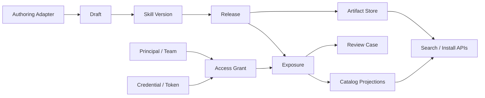

# Private-First Skill Registry Rearchitecture Design

Date: 2026-03-28

## Goal

Redesign `infinitas-skill` as a **private-first skill registry** where:

- the platform is primarily a private skill library, not a public marketplace
- creators can produce installable releases without mandatory review by default
- creators may optionally request review for non-public sharing
- public exposure always requires blocking review approval
- anonymous visitors can discover and install reviewed public skills
- permissions can be narrowed down to token, principal, skill, release, or exposure scope

This design intentionally does **not** preserve compatibility with the current submission / promotion / publish workflow. The objective is to replace that mixed lifecycle with a cleaner domain model.

## Product Position

The product should be framed as:

**A private skill registry with selective sharing and policy-gated public publication**

This framing matters because it changes the defaults:

- private is the default, not public
- installable release is a technical concept, not a trust signal
- public visibility is an exception path with stricter governance
- token sharing is a capability model, not a visibility model

## Why The Idea Is Reasonable

Your core idea is sound, but only if the following concepts are separated:

1. **Authoring**
   - editing a skill and producing a version snapshot
2. **Release**
   - generating an immutable installable artifact set
3. **Exposure**
   - declaring who may discover or install that release
4. **Review**
   - attaching trust and approval rules to an exposure request
5. **Access**
   - deciding whether a caller, user, service, or token can use the release

The current idea becomes fragile if "publish", "review", "visibility", and "token" are stored as one shared status field. That coupling is exactly what makes systems hard to extend later.

## External Patterns Worth Borrowing

These adjacent systems all separate package content from package access in some form:

| Product | Useful pattern | What to adopt |
| --- | --- | --- |
| GitHub Packages | Package visibility and package permissions can be managed separately from repository permissions; orgs can allow `public`, `private`, or `internal` package creation; packages may optionally inherit repo access. | Keep release identity separate from exposure policy. Treat inheritance as an adapter feature, not the core model. |
| GitLab Package Registry | Package registry visibility is independent from repo visibility; public, internal, and private access differ from publish permissions; deploy and project tokens are first-class machine credentials. | Separate audience, member role, and machine token concepts. |
| npm | Scoped packages default to private; granular access tokens can be narrowed to packages, scopes, expiry, IP ranges, and read/write level. | Make tokens fine-grained and resource-scoped. |
| AWS CodeArtifact | Package version status is independent from authorization tokens; version availability states such as `Published`, `Unlisted`, and `Archived` are separate from access control; tokens are short-lived. | Separate release state from access state and prefer short-lived install credentials. |
| Harbor | Public/private project visibility is separate from project robot accounts and system robot accounts. | Separate anonymous visibility from service credentials and grant machine access explicitly. |

### Reference links

- [GitHub Packages: Configuring a package's access control and visibility](https://docs.github.com/en/packages/learn-github-packages/configuring-a-packages-access-control-and-visibility)
- [GitLab Package Registry](https://docs.gitlab.com/user/packages/package_registry/)
- [GitLab Generic Packages](https://docs.gitlab.com/user/packages/generic_packages/)
- [npm: Creating and publishing private packages](https://docs.npmjs.com/creating-and-publishing-private-packages/)
- [npm: About access tokens](https://docs.npmjs.com/about-access-tokens/)
- [AWS CodeArtifact: Packages overview](https://docs.aws.amazon.com/codeartifact/latest/ug/packages-overview.html)
- [AWS CodeArtifact: Update package version status](https://docs.aws.amazon.com/codeartifact/latest/ug/update-package-version-status.html)
- [AWS CodeArtifact: Authentication and tokens](https://docs.aws.amazon.com/codeartifact/latest/ug/tokens-authentication.html)
- [Harbor: Create Projects](https://goharbor.io/docs/main/working-with-projects/create-projects/)
- [Harbor: Create Project Robot Accounts](https://goharbor.io/docs/main/working-with-projects/project-configuration/create-robot-accounts/)

## Decisive Recommendation

### Do not model `token-visible` as a visibility enum

`token-visible` is a reasonable product term, but it is the wrong core domain primitive.

The correct abstraction is:

- **audience**: who is allowed in principle
- **grant**: which explicit entitlement was issued
- **credential**: how that entitlement is presented

That means the internal model should use:

- `private`
- `grant`
- `authenticated`
- `public`

And the first UI can present:

- `Private`
- `Shared by token`
- `Public`

Where:

- `Private` maps to internal `private`
- `Shared by token` maps to internal `grant`
- `Public` maps to internal `public`

Reserve `authenticated` for future expansion. This keeps the schema extensible without forcing the first product surface to expose too many options.

### Do not model `publish` as the central workflow state

The core workflow should no longer ask one overloaded question:

- "Is this skill published?"

It should ask four independent questions instead:

1. Is there an immutable release?
2. Is that release actively exposed to some audience?
3. Has required review for that exposure passed?
4. Does this caller have an entitlement that satisfies the exposure?

## Architectural Shape

The recommended architecture is a **modular monolith with strict domain boundaries**, backed by:

- PostgreSQL for transactional state
- object storage for immutable artifacts
- background workers for artifact materialization and projection refresh
- optional Git integration as an authoring adapter, not as runtime authority

This is the right tradeoff for a private registry:

- much simpler than microservices
- still cleanly separable by module
- easy to evolve later into services if scale demands it

### High-level flow



## Bounded Contexts

### 1. Authoring

Responsibilities:

- create and update mutable drafts
- ingest content from Git, upload, API, or Web editor
- produce a sealed version snapshot

Non-responsibilities:

- public visibility
- review policy
- install authorization

### 2. Release

Responsibilities:

- materialize a sealed version into immutable artifacts
- generate bundle, manifest, digest, provenance, signature, preview assets
- manage release readiness and artifact lifecycle

Non-responsibilities:

- deciding whether a release is public
- deciding who can install it

### 3. Exposure

Responsibilities:

- declare intended audience for a release
- manage listing state and installability state
- trigger policy evaluation
- activate, revoke, expire, or supersede exposure

Non-responsibilities:

- producing artifacts
- authenticating callers

### 4. Review

Responsibilities:

- evaluate exposure requests against policy
- open advisory or blocking review cases
- record decisions, comments, evidence, and expiry

Non-responsibilities:

- building releases
- issuing credentials

### 5. Access

Responsibilities:

- represent principals, service identities, teams, and grants
- issue and revoke credentials
- answer authorization checks for catalog and install endpoints

Non-responsibilities:

- deciding whether a release should be public

### 6. Discovery And Installation

Responsibilities:

- maintain audience-specific catalog projections
- search visible skills for a caller
- resolve install metadata and artifact URLs

Non-responsibilities:

- mutating workflow state directly

### 7. Audit

Responsibilities:

- append immutable audit events
- support timeline, forensics, and compliance views

## Canonical Domain Model

### Core entities

| Entity | Purpose | Notes |
| --- | --- | --- |
| `Namespace` | ownership boundary for skills | user, team, or organization owned |
| `Skill` | long-lived skill identity | stable slug, namespace, metadata |
| `SkillDraft` | mutable authoring workspace | editable, not installable |
| `SkillVersion` | immutable content snapshot | semver or monotonic version |
| `Release` | installable materialization of one version | references artifacts |
| `Artifact` | bundle, manifest, signature, sbom, provenance | immutable and content-addressed |
| `Exposure` | who can discover/install a release | audience and listing policy live here |
| `ReviewPolicy` | rules engine input | versioned and snapshot-able |
| `ReviewCase` | review workflow instance | tied to an exposure |
| `ReviewDecision` | reviewer action log | append-only |
| `AccessGrant` | explicit entitlement for non-public sharing | principal or link style |
| `Credential` | token or secret used to present access | short-lived when possible |
| `AuditEvent` | immutable domain history | append-only |

### Recommended storage model

#### `namespaces`

- `id`
- `kind` = `user | team | org`
- `slug`
- `display_name`
- `owner_principal_id`
- `policy_profile_id`

#### `skills`

- `id`
- `namespace_id`
- `slug`
- `display_name`
- `summary`
- `status` = `active | archived`
- `default_visibility_profile`
- `created_by`
- `created_at`

#### `skill_drafts`

- `id`
- `skill_id`
- `base_version_id`
- `state` = `open | sealed | abandoned`
- `content_ref`
- `metadata_json`
- `updated_by`
- `updated_at`

#### `skill_versions`

- `id`
- `skill_id`
- `version`
- `content_digest`
- `metadata_digest`
- `created_from_draft_id`
- `created_by`
- `created_at`

#### `releases`

- `id`
- `skill_version_id`
- `state` = `preparing | ready | failed | withdrawn`
- `format_version`
- `manifest_artifact_id`
- `bundle_artifact_id`
- `signature_artifact_id`
- `provenance_artifact_id`
- `ready_at`
- `created_by`
- `created_at`

#### `artifacts`

- `id`
- `release_id`
- `kind` = `bundle | manifest | signature | provenance | sbom | preview`
- `storage_uri`
- `sha256`
- `size_bytes`
- `created_at`

#### `exposures`

- `id`
- `release_id`
- `audience_type` = `private | grant | authenticated | public`
- `listing_mode` = `listed | direct_only`
- `install_mode` = `enabled | disabled`
- `review_requirement` = `none | advisory | blocking`
- `state` = `draft | pending_policy | review_open | active | rejected | revoked | expired | superseded`
- `requested_by`
- `policy_snapshot_json`
- `activated_at`
- `ended_at`

#### `review_policies`

- `id`
- `name`
- `version`
- `is_active`
- `rules_json`
- `created_at`

#### `review_cases`

- `id`
- `exposure_id`
- `policy_id`
- `mode` = `advisory | blocking`
- `state` = `open | approved | rejected | expired | superseded`
- `opened_by`
- `opened_at`
- `closed_at`

#### `review_decisions`

- `id`
- `review_case_id`
- `reviewer_principal_id`
- `decision` = `comment | approve | reject | request_changes`
- `note`
- `evidence_json`
- `created_at`

#### `access_grants`

- `id`
- `exposure_id`
- `grant_type` = `principal | team | service | link`
- `subject_ref`
- `constraints_json`
- `state` = `active | revoked | expired`
- `created_by`
- `created_at`

#### `credentials`

- `id`
- `principal_id`
- `grant_id`
- `type` = `personal_token | service_token | grant_token | ephemeral_download_token`
- `hashed_secret`
- `scopes_json`
- `resource_selector_json`
- `expires_at`
- `revoked_at`
- `last_used_at`

#### `audit_events`

- `id`
- `aggregate_type`
- `aggregate_id`
- `event_type`
- `actor_ref`
- `payload_json`
- `occurred_at`

## State Machines

### Draft lifecycle

```text
open -> sealed
open -> abandoned
```

Rules:

- only `open` drafts are editable
- sealing a draft creates an immutable `SkillVersion`
- a sealed draft can never become editable again

### Release lifecycle

```text
preparing -> ready
preparing -> failed
ready -> withdrawn
```

Rules:

- only `ready` releases may be exposed
- content changes create a new version and a new release, never mutate a ready release

### Exposure lifecycle

```text
draft -> pending_policy -> active
draft -> pending_policy -> review_open -> active
review_open -> rejected
active -> revoked
active -> expired
active -> superseded
```

Rules:

- `private` defaults to `review_requirement=none`
- `grant` defaults to `review_requirement=none` but creator may request `advisory` or `blocking`
- `public` is always promoted to `review_requirement=blocking`
- only one active `public` listed exposure should exist for a given skill line unless the product explicitly supports multi-release public views

### Review lifecycle

```text
open -> approved
open -> rejected
open -> expired
open -> superseded
```

Rules:

- blocking approval is attached to an exposure, not to a mutable draft
- because releases are immutable, a new release requires a new public exposure and therefore a new blocking review

### Credential lifecycle

```text
active -> expired
active -> revoked
```

Rules:

- prefer short TTL for machine and download credentials
- long-lived credentials should be exceptional and always revocable

## Business Rules

### Visibility and review rules

1. Every new release starts with **no exposure**.
2. Creators may activate `private` exposure with no review.
3. Creators may activate `grant` exposure with no review.
4. Creators may optionally request `advisory` or `blocking` review for `private` or `grant` exposure.
5. `public` exposure always requires blocking review approval.
6. Anonymous discovery and install are only possible through active `public` exposure.
7. A release may have multiple simultaneous exposures if policy allows it.

Example:

- release `1.2.0` may be `private` for the author team
- the same release may also be `grant`-shared to a customer token
- after review, the same release may become `public`

That flexibility is why exposure must be separate from release.

### Listing vs installability

Do not collapse search visibility and installability into a single flag.

Two independent controls are better:

- `listing_mode`
  - `listed`
  - `direct_only`
- `install_mode`
  - `enabled`
  - `disabled`

Examples:

- a `grant` exposure may be `direct_only` but installable
- a `public` exposure may remain listed but install-disabled during incident response

### Optional review semantics

For non-public exposure, the creator should be able to choose:

- `none`
  - no review case is opened
- `advisory`
  - review runs, but activation does not wait for approval
- `blocking`
  - activation waits for approval

For public exposure, the policy engine must always coerce the mode to `blocking`.

## Access Model

### Principals

Treat these as separate principal types:

- `user`
- `team`
- `service`
- `anonymous`

### Grants

`AccessGrant` is the entitlement layer for non-public sharing.

Grant examples:

- grant release `abc` to user `u1`
- grant release `abc` to team `t1`
- grant release `abc` to service `build-bot`
- grant release `abc` to opaque link token `g_tok_123`

### Credentials

Credentials are how access is presented.

Recommended credential types:

- `personal_token`
  - bound to a human principal
- `service_token`
  - bound to a service principal
- `grant_token`
  - bound to an explicit access grant
- `ephemeral_download_token`
  - short-lived token issued after access is verified

### Scope model

Scopes should be resource-oriented instead of global-role-only.

Examples:

- `draft:read`
- `draft:write`
- `release:create`
- `release:read`
- `exposure:manage`
- `review:request`
- `review:decide`
- `credential:issue`
- `artifact:download`

Each credential should also support a resource selector, for example:

- namespace scoped
- skill scoped
- release scoped
- exposure scoped
- grant scoped

### Important design rule

Tokens must never have more power than the principal or grant that issued them.

This matches the best part of npm granular tokens and GitLab deploy/project token design.

## Review Policy Engine

### Why it exists

The platform should not hard-code every review condition into endpoint logic.

Instead:

- policy rules determine whether review is required
- review cases are workflow instances created from policy output
- the exposure stores a policy snapshot for reproducibility

### Minimum first-pass rules

```yaml
rules:
  - when:
      audience_type: public
    require_review: blocking

  - when:
      audience_type: grant
      creator_requested_review: advisory
    require_review: advisory

  - when:
      audience_type: grant
      creator_requested_review: blocking
    require_review: blocking

  - when:
      audience_type: private
    require_review: none
```

### Future rules that fit naturally

- require blocking review for specific namespaces
- require malware scan for executable skills
- require two approvers for high-risk categories
- expire approvals after a fixed time
- require provenance artifacts before public exposure

## Discovery And Read Planes

### Recommendation

Use separate read models instead of filtering one giant catalog at request time.

Recommended projections:

1. `public_catalog_projection`
   - only active public listed exposures
   - safe for anonymous access and CDN caching

2. `principal_catalog_projection`
   - releases visible to logged-in users via ownership, membership, or direct grant
   - can be query-optimized by principal and team membership

3. `grant_projection`
   - releases visible via grant token
   - optimized for token introspection and direct install

4. `artifact_projection`
   - release-to-artifact resolution for installer clients

### Why this matters

The current all-or-nothing registry-reader shape does not fit a mixed private / shared / public product. Search and install need audience-aware projections.

## API Shape

### Authoring

- `POST /v1/skills`
- `POST /v1/skills/{skill_id}/drafts`
- `PATCH /v1/drafts/{draft_id}`
- `POST /v1/drafts/{draft_id}/seal`

### Release

- `POST /v1/versions/{version_id}/releases`
- `GET /v1/releases/{release_id}`
- `GET /v1/releases/{release_id}/artifacts`

### Exposure

- `POST /v1/releases/{release_id}/exposures`
- `PATCH /v1/exposures/{exposure_id}`
- `POST /v1/exposures/{exposure_id}/activate`
- `POST /v1/exposures/{exposure_id}/revoke`

Example create exposure request:

```json
{
  "audience_type": "grant",
  "listing_mode": "direct_only",
  "install_mode": "enabled",
  "requested_review_mode": "advisory"
}
```

### Review

- `POST /v1/exposures/{exposure_id}/review-cases`
- `POST /v1/review-cases/{review_case_id}/decisions`
- `GET /v1/review-cases/{review_case_id}`

### Access and credentials

- `POST /v1/exposures/{exposure_id}/grants`
- `POST /v1/grants/{grant_id}/tokens`
- `POST /v1/tokens`
- `POST /v1/tokens/introspect`
- `POST /v1/download-tokens`

### Discovery

- `GET /v1/catalog/public`
- `GET /v1/catalog/me`
- `GET /v1/catalog/grant`
- `GET /v1/search/public?q=...`
- `GET /v1/search/me?q=...`

### Install

- `GET /v1/install/public/{skill_ref}`
- `GET /v1/install/me/{skill_ref}`
- `GET /v1/install/grant/{skill_ref}`

Install responses should resolve:

- skill identity
- release id
- version
- manifest digest
- artifact URLs
- provenance and signature metadata

## Recommended UI Vocabulary

The UI should stop using overloaded words such as "publish" for every operation.

Recommended user-facing actions:

- `Save draft`
- `Seal version`
- `Generate release`
- `Share privately`
- `Share by token`
- `Request review`
- `Submit for public publication`
- `Revoke access`

Recommended visibility labels:

- `Private`
  - visible only to owners and directly authorized internal principals
- `Shared by token`
  - visible through an explicit grant token
- `Public`
  - visible to everyone after approval

Recommended status chips:

- `Draft`
- `Release ready`
- `Private active`
- `Shared by token`
- `Review in progress`
- `Public approved`
- `Public rejected`
- `Access revoked`

## Recommended Module Layout

If this is implemented in the current codebase, prefer module boundaries like:

```text
server/
  modules/
    authoring/
    release/
    exposure/
    review/
    access/
    discovery/
    audit/
```

Each module should own:

- API routes
- service layer
- domain models
- events
- projections
- tests

And modules should communicate through:

- explicit service interfaces
- domain events
- projection readers

They should not reach into each other's tables ad hoc.

## What To Delete From The Current Mental Model

The clean-sheet redesign should remove these ideas:

1. A single `submission.status` as the registry workflow brain.
2. A single `publish` transition that simultaneously means:
   - reviewed
   - promoted
   - exposed
   - downloadable
3. Global reader authorization for search and install.
4. Metadata-only `visibility` with no runtime enforcement.
5. Review approval stored as if it were a permanent property of mutable content.

## Implementation Sequence

### Phase 1: Establish the new language

- add the new domain vocabulary to docs and UI copy
- stop expanding the old submission/publish state machine

### Phase 2: Build the canonical write model

- introduce `SkillDraft`, `SkillVersion`, `Release`, `Exposure`, `AccessGrant`, and `Credential`
- make release artifacts immutable and content-addressed

### Phase 3: Build the policy and review layer

- add the policy engine
- implement advisory vs blocking review
- make public exposure policy-gated

### Phase 4: Build the access layer

- introduce principal-aware authorization
- add grant tokens and service tokens
- issue ephemeral download tokens

### Phase 5: Build projections and install APIs

- public projection
- principal projection
- grant projection
- install resolution endpoints

### Phase 6: Rebuild UI on top of the new vocabulary

- draft page
- release page
- share page
- review page
- access and token management page

## Final Recommendation

If you only keep one design rule, keep this one:

**Release, exposure, review, and access must be four different concepts.**

Everything else becomes easier once that boundary is respected:

- optional review for private sharing
- mandatory review for public sharing
- anonymous public install
- token-granular permissions
- future support for authenticated-only visibility
- future support for enterprise, team, or paid access tiers

That separation is what makes the system both easier to reason about now and safer to extend later.
